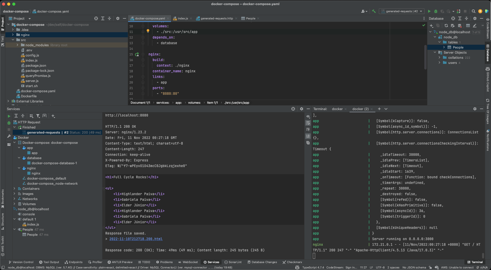

# Nginx + Node

This is a simple example of how to use Nginx as a reverse proxy for Node.js.

## Usage

1. Install [Docker](https://www.docker.com/)
2. Clone this repository
3. Run `docker-compose up -d`
4. Visit [http://localhost:8080](http://localhost:8080)

## Test

